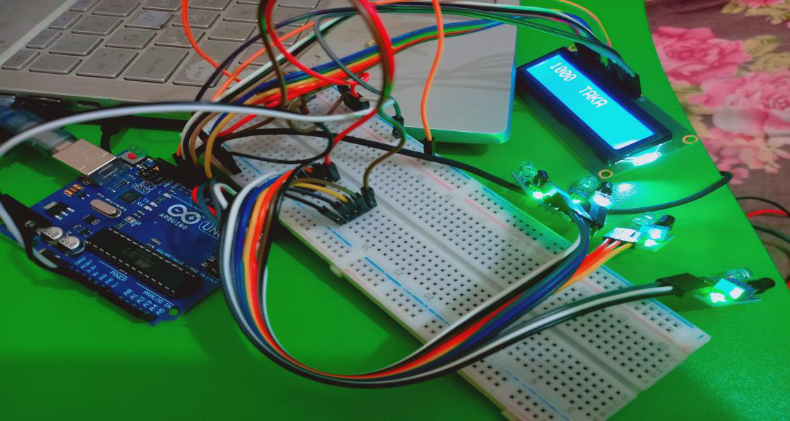
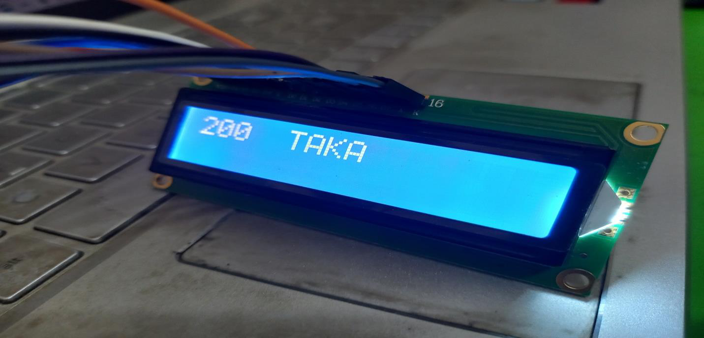
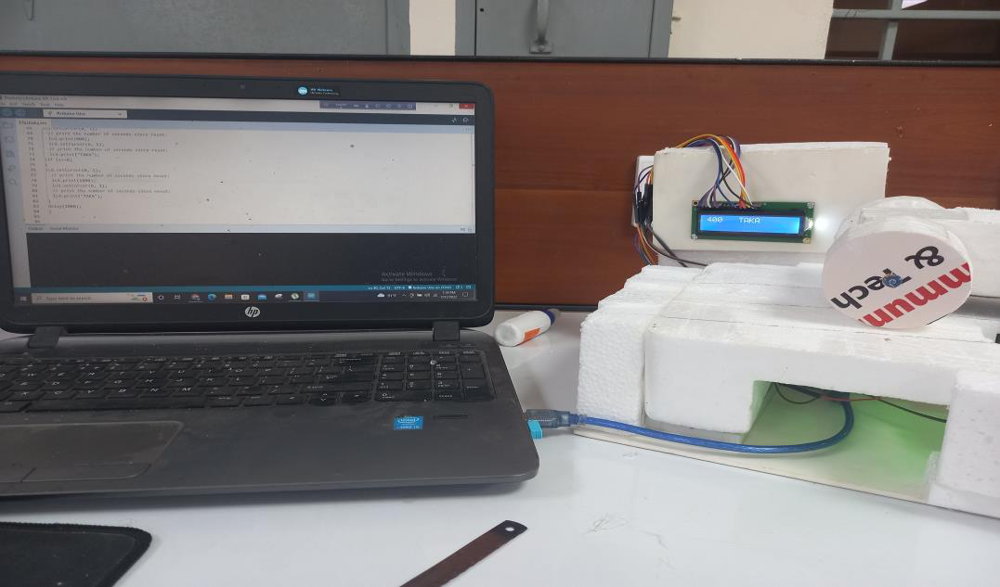
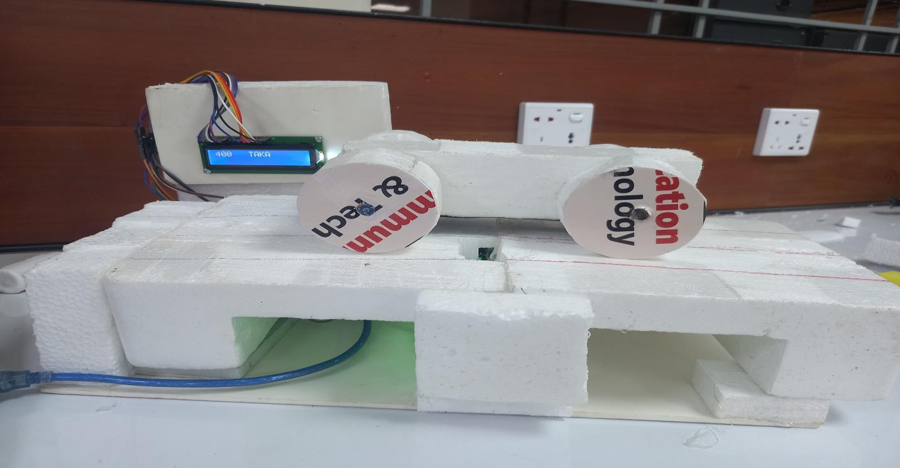

# **Modern Toll Management System by Arduino Uno**

## **Project Overview**

This project presents a modern toll management system using Arduino Uno, IR sensors, and an LCD display. The system detects the number of wheels of a vehicle using IR sensors and determines the toll fee based on the detected wheel count.

The calculated toll fee is displayed on an LCD screen. This project demonstrates how an automatic toll fee detection system can reduce manual work, save time, and improve toll collection efficiency.

## **Motivation**

Modern toll management systems are useful because they can reduce waiting time, improve traffic flow, increase safety, and reduce manual toll collection effort.

Electronic tolling can help vehicles pass toll points more efficiently. It also reduces unnecessary waiting and idling, which can help lower pollution near toll plazas.

## **Objectives**

* To determine the number of wheels of a vehicle for calculating toll fees.
* To display the toll fee on an LCD screen.
* To collect tolls in an efficient and automated way.
* To reduce manual effort in toll fee calculation.
* To demonstrate an Arduino-based prototype of a toll management system.

## **Main Components**

| SL No. | Component Name        | Quantity |
| ------ | --------------------- | -------- |
| 01     | Arduino Uno           | 01       |
| 02     | IR Sensor             | 02       |
| 03     | LCD Screen            | 01       |
| 04     | Jumper Wires          | Several  |
| 05     | Variable Resistor 10K | 01       |

## **Circuit Connection**

A positive rail and a negative rail are connected to the `+5V` pin and `GND` pin of the Arduino Uno respectively.

The two IR sensors are connected as follows:

* The `VCC` pins of the IR sensors are connected to the positive rail.
* The `GND` pins of the IR sensors are connected to the negative rail.
* The output pins of the IR sensors are connected to Arduino digital pins.

The LCD is operated in write mode using the `LiquidCrystal` library.

LCD pin connection:

| LCD Pin | Arduino Pin    |
| ------- | -------------- |
| RS      | Digital Pin 7  |
| EN      | Digital Pin 8  |
| D4      | Digital Pin 12 |
| D5      | Digital Pin 11 |
| D6      | Digital Pin 10 |
| D7      | Digital Pin 9  |

A 10K potentiometer is used to adjust the LCD contrast.

## **Circuit Images**

### **Figure 1: Circuit Design of Modern Toll Management System**



This figure shows the circuit connection of the modern toll management system using Arduino Uno, IR sensors, LCD display, jumper wires, and breadboard.

### **Figure 2: LCD Display Checking**




This figure shows the LCD display during testing. The display shows the calculated toll amount in TAKA.

## **Output Images**

### **Figure 3: Serial Monitoring for Modern Toll Management System**




This figure shows the serial monitoring process during code testing. Sensor values are checked in the serial monitor to verify the detection process.

### **Figure 4: Final Output of Modern Toll Management System**




This figure shows the final prototype output of the modern toll management system. The system detects the vehicle wheel count and displays the toll fee on the LCD screen.

## **Working Principle**

A variable named `z` is used to count the number of wheel detections from the IR sensors. Initially, the value of `z` is set to zero.

When a wheel passes over an IR sensor, the sensor value changes. If the sensor output becomes `0`, the value of `z` increases by 1.

The toll fee is calculated based on the value of `z`.

| Wheel Count / z Value | Toll Fee  |
| --------------------- | --------- |
| z = 2                 | 200 TAKA  |
| z = 3                 | 250 TAKA  |
| z = 4                 | 400 TAKA  |
| z = 6                 | 800 TAKA  |
| z = 8                 | 1000 TAKA |

After the vehicle pays the toll fee, the Arduino can be reset to start detecting the next vehicle.

## **Arduino Code**

The Arduino source code is stored in:

```text
modern_toll_management_system_code.ino
```


## **Result**

The project was successfully completed. The prototype was able to detect wheel counts using IR sensors and display the corresponding toll fee on the LCD screen.

## **Discussion**

At first, a concept was developed to determine the number of wheels of a vehicle. The circuit was designed carefully and the Arduino code was checked several times using serial monitoring.

After finalizing the code, all components were arranged on a hardboard road-track prototype. The prototype worked properly and produced the expected result.

This system can reduce time and manpower in toll collection. The modern toll management system was found effective in determining toll fees and displaying them automatically.

## **Applications**

* Automatic toll collection prototype
* Smart traffic management system
* Vehicle classification system
* Arduino-based automation project
* Sensor-based fee calculation system
* Educational embedded system project

## **Limitations**

* The project is a prototype model.
* Only two IR sensors are used.
* The system requires reset after each vehicle.
* Real-life implementation would require stronger sensors and a more advanced payment system.
* Vehicle detection accuracy depends on proper sensor placement.

## **Future Improvements**

* Add RFID-based payment system.
* Add automatic barrier gate control using a servo motor.
* Store toll records using an SD card module.
* Add real-time data logging.
* Add IoT-based monitoring system.
* Improve wheel detection accuracy using more sensors.
* Add automatic reset after each vehicle passes.
